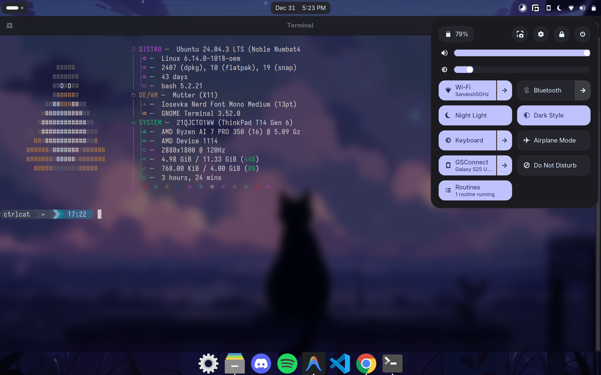

# MeowterialYou :cat:

A fork of [Mitsugen](https://github.com/DimitrisMilonopoulos/mitsugen) by Dimitris Milonopoulos, bringing Material You theming to Linux desktops. This fork exists because the original repository is no longer actively maintained and had an ambiguous installation process.

Thanks to the original author for the foundation this project builds upon.



---

## What Changed in This Fork

- Rewrote the installation process with an interactive TUI, automatic dependency handling, and progress indicators
- Fixed broken notification popups in GNOME Shell
- Removed distracting background styles from system tray icons in the panel
- Extended theming to gnome-terminal, native gnome apps sidebars, GNOME Shell popups, and Tiling Assistant tile previews
- Added macOS-style circular window buttons with left/right positioning options
- Added GTK4 theme support for Chrome and Chromium on Wayland
- Integration with GNOME Routines for automatic theme updates when wallpaper changes
- Renamed theme consistently to `MeowterialYou` to avoid confusion
- Added single-command uninstall that cleans up all generated files

---

## Installation

### Installation

Clone the repository and run the installer. The repository directory **IS** the installation, so keep it in a safe place (like `~/Repositories` or `~/MeowterialYou`).

```bash
git clone https://github.com/supSugam/MeowterialYou.git ~/MeowterialYou
cd ~/MeowterialYou
chmod +x install.sh
./install.sh
```

> [!CAUTION]
> **Do NOT delete this repository folder after installation!**
> 
> The theme regenerates from this repo every time your wallpaper changes. Deleting it will break theme updates. Only delete it if you want to completely uninstall MeowterialYou.

The installer will alias the `meowterialyou` command to this directory. You can move the folder later, but you'll need to re-run `./install.sh` to update the alias.

### System Requirements

- Python 3.10+
- GNOME Desktop Environment
- PyGObject (installed automatically)

---

## Usage

### Apply Theme

```bash
# Use current wallpaper
meowterialyou

# Specify wallpaper
meowterialyou --wallpaper ~/Pictures/wallpaper.jpg

# Light theme
meowterialyou --theme light

# macOS-style buttons on left
meowterialyou --title-buttons mac --title-buttons-position left
```

### Command Reference

| Option | Description |
|--------|-------------|
| `--defaults` | Install with default settings (dark, native buttons) without prompts |
| `--reapply` | **Reapply** using last saved configuration (silent, good for automation) |
| `--wallpaper PATH` | Path to wallpaper image (default: current wallpaper) |
| `--theme [dark\|light]` | Theme mode (default: dark) |
| `--title-buttons [mac\|native]` | Window button style (default: native) |
| `--title-buttons-position [left\|right]` | Button position (default: right) |
| `--chrome-gtk4` | Install GTK4 theme for Chrome (default: false) |
| `--ui-improvements` | Enable UI improvements addon (transparent tray icons) |
| `--silent` | Disable desktop notifications |
| `--uninstall` | Remove all theme files and aliases |
| `--help` | Show all options |

---

## Chrome/Chromium Support

Chrome on Wayland uses GTK4 for window decorations. You have two options:

**Option 1**: Install the GTK4 theme during setup
```bash
meowterialyou --chrome-gtk4
```

**Option 2**: Force Chrome to use GTK3 (no additional setup needed)
```bash
google-chrome --gtk-version=3
```

To make Option 2 permanent, edit your Chrome `.desktop` file and add `--gtk-version=3` to the `Exec` line.

---

## Automatic Theme Updates

Use [GNOME Routines](https://github.com/supSugam/gnome-routines) to automatically update your theme when the wallpaper changes:

1. Install [GNOME Routines](https://github.com/supSugam/gnome-routines)
2. Create a routine with:
   - **Trigger**: Wallpaper changes
   - **Action**: Run command
   - **Command**: `meowterialyou --reapply`
   
   Using `--reapply` ensures the theme updates silently using your last saved configuration (dark/light, button style, etc.).

---

## Supported Applications

- GNOME Shell
- GTK3 and GTK4 applications
- VS Code (requires custom CSS extension)
- Obsidian (with Adwaita theme)
- Vivaldi
- BetterDiscord
- Spotify (via Spicetify)

---

## Uninstall

```bash
./install.sh --uninstall
```

Or run the installer and select "Uninstall" from the menu.

---

## Troubleshooting

### User Themes Extension Error

If you encounter issues with the User Themes extension:

```bash
sudo cp $HOME/.local/share/gnome-shell/extensions/user-theme@gnome-shell-extensions.gcampax.github.com/schemas/org.gnome.shell.extensions.user-theme.gschema.xml /usr/share/glib-2.0/schemas && sudo glib-compile-schemas /usr/share/glib-2.0/schemas
```

See [this gist](https://gist.github.com/atiensivu/fcc3183e9a6fd74ec1a283e3b9ad05f0) for more details.

---

## Contributing

Contributions are welcome. Please open an issue first to discuss what you would like to change.

- **Bug Reports**: Use the [bug report template](.github/ISSUE_TEMPLATE/bug_report.md)
- **Feature Requests**: Use the [feature request template](.github/ISSUE_TEMPLATE/feature_request.md)

---

## Credits

- [Mitsugen](https://github.com/DimitrisMilonopoulos/mitsugen) by Dimitris Milonopoulos (original project)
- [Material Color Utilities Python](https://github.com/avanisubbiah/material-color-utilities-python)
- [Obsidian Adwaita Theme](https://github.com/birneee/obsidian-adwaita-theme)
- [Spicetify Themes](https://github.com/spicetify/spicetify-themes)
- [Matugen](https://github.com/InioX/matugen)

---

## License

This project inherits the license from the original Mitsugen project.
